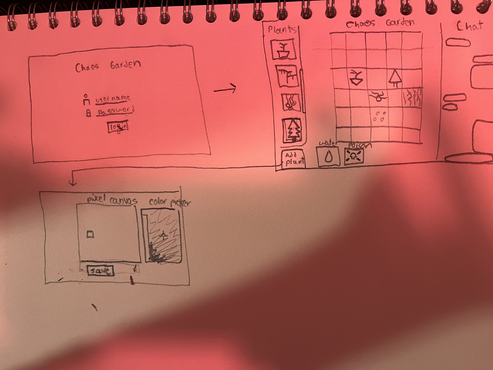

# chaos-garden

## pitch

I want to create an experimental collaborative community project based on the ideas of a zen garden and a shared whiteboard.
The end result will be somewhat similar to reddit's r/place shared pixel canvas. I named this project chaos garden because I probably
don't have enough faith in humanity.

## design

## key features
- a shared grid in which users can place plants
- a drawing feature that allows users to add new plants to the database
- a chat that allows the community to coordinate (or not) the garden
- a water feature that allows you to increase the health of any plant as many times as you click
- a posion feature that allows you to decrease the health of any plant as many times as you click

## Key technologies
- authentication: implement a standard authentication page
- database data: plant image and health data, and chat history
- websocket data: user chat

A Collabrative zen garden left up to the community

Project for CS260
